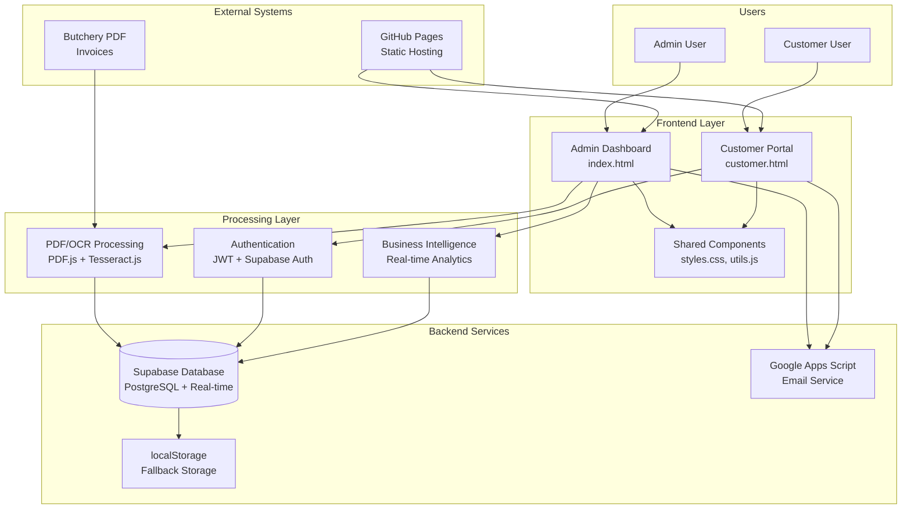
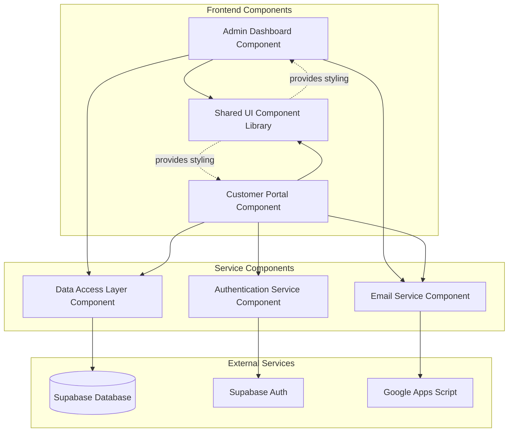
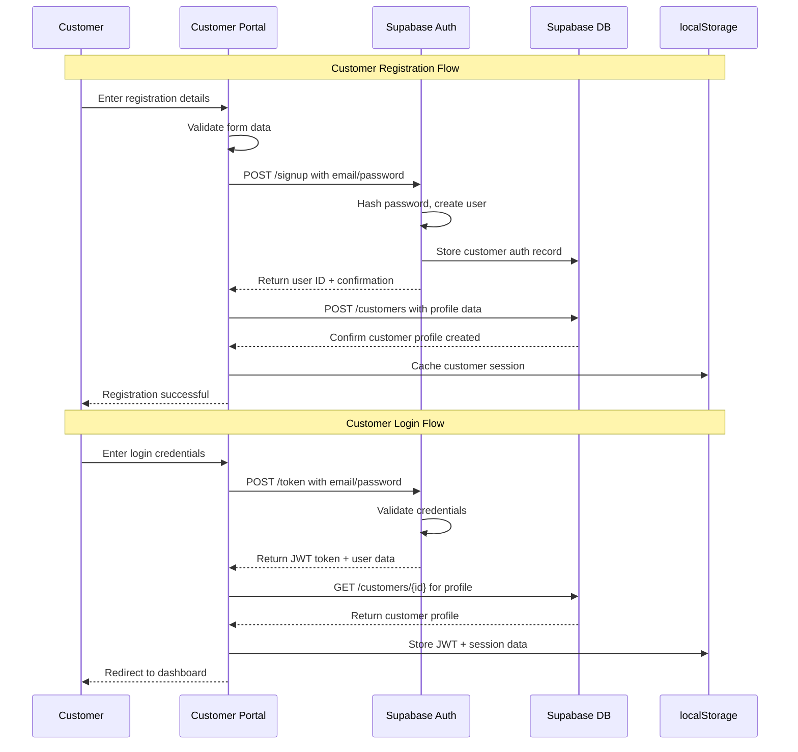
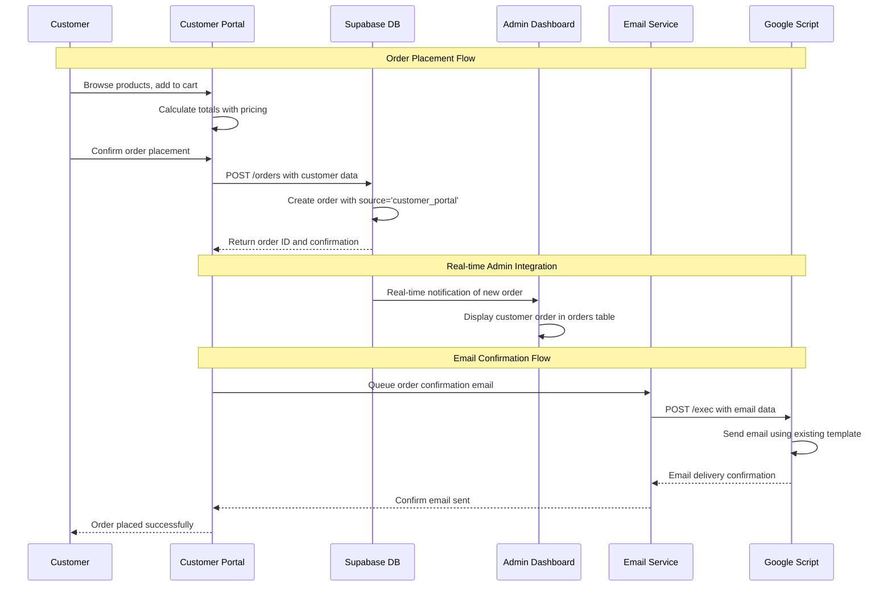
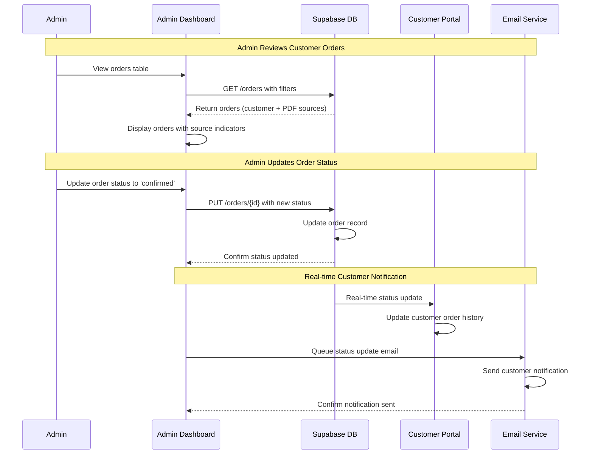
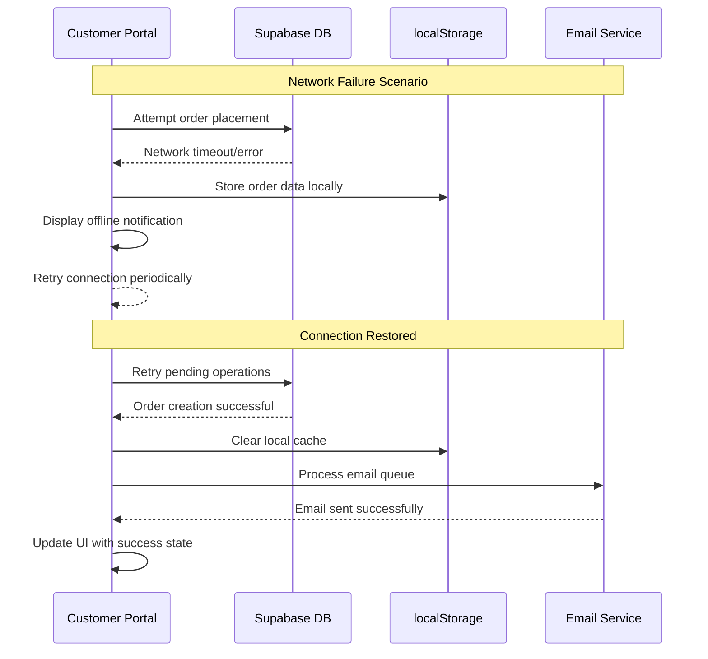

# Plaas Hoenders Architecture Document

## Introduction

This document outlines the overall project architecture for Plaas Hoenders, including backend systems, shared services, and non-UI specific concerns. Its primary goal is to serve as the guiding architectural blueprint for AI-driven development, ensuring consistency and adherence to chosen patterns and technologies.

**Relationship to Frontend Architecture:**
If the project includes a significant user interface, a separate Frontend Architecture Document will detail the frontend-specific design and MUST be used in conjunction with this document. Core technology stack choices documented herein (see "Tech Stack") are definitive for the entire project, including any frontend components.

### Starter Template or Existing Project

Based on my analysis of your existing Plaas Hoenders project, this is a **brownfield enhancement** to an existing, well-architected system. The project is NOT based on a starter template but rather extends a mature admin dashboard with sophisticated features:

**Existing Project Analysis**:
- **Current Architecture**: Vanilla JavaScript SPA with modular section-based navigation
- **Technology Foundation**: Static hosting (GitHub Pages), Supabase database, Google Apps Script integration
- **Mature Features**: OCR PDF processing, Business Intelligence analytics, email automation
- **Proven Patterns**: Dual-layer persistence, robust error handling, mobile-responsive design
- **Deployment Pipeline**: Git → GitHub Pages with 2-5 minute deployment cycle

**Architectural Foundation**: The existing system provides excellent architectural patterns that will be extended rather than replaced. The customer portal will leverage existing infrastructure while adding new customer-facing components.

**No Starter Template Used**: The current system was built from scratch and has evolved into a sophisticated platform. The customer portal enhancement will follow established patterns rather than introducing external templates.

### Change Log

| Change | Date | Version | Description | Author |
|--------|------|---------|-------------|---------|
| Initial Architecture Creation | 2025-01-08 | 1.0 | Customer portal architecture for brownfield enhancement | Quinn (QA) |

## High Level Architecture

### Technical Summary

The Plaas Hoenders system employs a **hybrid client-server architecture** with static frontend hosting and cloud-managed backend services. The architecture extends the existing admin dashboard with a customer portal that shares core infrastructure while maintaining clear separation of concerns. Key components include dual-layer data persistence (Supabase primary, localStorage fallback), sophisticated PDF processing with AI/OCR, and Google Apps Script for email automation. The system follows a **modular monolithic pattern** with clear component boundaries, enabling the customer portal to integrate seamlessly without disrupting existing butchery workflow operations. This architecture directly supports the PRD goals of customer self-service while preserving the proven admin dashboard functionality.

### High Level Overview

**Architectural Style**: **Modular Monolithic** with service-oriented components
- Single codebase with clear module boundaries
- Shared infrastructure between admin and customer interfaces
- Component-based organization enabling independent development

**Repository Structure**: **Monorepo approach**
- Single repository housing both admin dashboard and customer portal
- Shared utilities and styling components
- Unified deployment pipeline via GitHub Pages

**Service Architecture**: **Static Frontend + Managed Backend Services**
- Frontend: Static HTML/CSS/JavaScript served from GitHub Pages
- Database: Supabase (managed PostgreSQL) with real-time capabilities  
- Email: Google Apps Script HTTP service
- Authentication: Client-side JWT with Supabase Auth integration

**Primary Data Flow**:
1. **Admin Flow**: PDF Upload → OCR Processing → Order Import → Invoice Generation → Email Queue
2. **Customer Flow**: Authentication → Product Browse → Order Placement → Admin Integration → Email Confirmation
3. **Unified Backend**: Both flows converge in Supabase database with shared pricing and email systems

**Key Architectural Decisions**:
- **Shared Infrastructure**: Customer portal leverages existing Supabase and email systems (reduces complexity, ensures consistency)
- **Separate Entry Points**: customer.html and index.html provide distinct interfaces while sharing core components
- **Component Isolation**: Customer functionality isolated in separate JavaScript files to prevent admin impact

### High Level Project Diagram



### Architectural and Design Patterns

**- Modular Monolith Pattern:** Single codebase with clear module boundaries between admin and customer functionality - *Rationale:* Enables shared infrastructure while maintaining development independence and simplified deployment

**- Repository Pattern:** Abstract data access through consistent interfaces for Supabase operations - *Rationale:* Provides testability, enables fallback to localStorage, and supports future database migrations if needed

**- Dual-Layer Persistence:** Supabase primary storage with localStorage backup/cache - *Rationale:* Ensures system availability during network issues while providing real-time sync capabilities

**- Component-Based UI:** Reusable UI components shared between admin and customer interfaces - *Rationale:* Maintains visual consistency, reduces code duplication, and accelerates customer portal development

**- Event-Driven Email Queue:** Asynchronous email processing through queue mechanism - *Rationale:* Prevents blocking operations, enables batch processing, and provides retry capabilities for failed deliveries

**- Stateless Authentication:** JWT tokens with client-side session management - *Rationale:* Aligns with static hosting model, reduces server complexity, and enables offline capability

## Tech Stack

### Cloud Infrastructure

- **Provider**: GitHub Pages + Supabase Cloud + Google Apps Script
- **Key Services**: Static hosting, managed PostgreSQL, real-time subscriptions, email automation
- **Deployment Regions**: Global CDN (GitHub Pages), US-East (Supabase primary)

### Technology Stack Table

| Category | Technology | Version | Purpose | Rationale |
|----------|------------|---------|---------|-----------|
| **Language** | JavaScript | ES6+ (2023) | Primary development language | Existing codebase standard, excellent browser support |
| **Runtime** | Browser | Modern browsers | Client-side execution | Static hosting model, existing architecture |
| **Frontend Framework** | Vanilla JavaScript | N/A | UI framework | Maintains existing patterns, no framework overhead |
| **CSS Framework** | Custom CSS + Grid/Flexbox | CSS3 | Styling system | Existing responsive design, professional appearance |
| **Icons** | FontAwesome | 6.0.0 | Icon library | Currently used, consistent visual language |
| **Database** | Supabase | Latest Stable | Primary data persistence | Existing proven integration, real-time capabilities |
| **Database Engine** | PostgreSQL | 15+ (managed) | SQL database engine | Managed by Supabase, ACID compliance |
| **Authentication** | Supabase Auth | Latest | Customer authentication | Native Supabase integration, JWT tokens |
| **Session Management** | JWT + localStorage | N/A | Client session storage | Stateless, compatible with static hosting |
| **Password Hashing** | bcrypt (via Supabase) | N/A | Secure password storage | Industry standard, managed by Supabase |
| **Email Service** | Google Apps Script | Latest | Email delivery | Existing proven integration |
| **PDF Processing** | PDF.js | 3.11.174 | PDF text extraction | Existing integration for butchery invoices |
| **OCR Processing** | Tesseract.js | 4.1.1 | Image text recognition | Existing integration for scanned documents |
| **Hosting** | GitHub Pages | N/A | Static site hosting | Current deployment, zero-cost scaling |
| **Version Control** | Git + GitHub | Latest | Source code management | Current workflow, integrated deployment |
| **Build Process** | None (Static) | N/A | Deployment pipeline | Simple git push deployment |

## Data Models

### Customer

**Purpose:** Represents registered customers who can place orders through the customer portal, extending beyond the simple name/email data currently stored with orders.

**Key Attributes:**
- customerId: UUID - Unique customer identifier generated by Supabase
- email: String (unique) - Primary login credential and communication method
- passwordHash: String - Securely hashed password managed by Supabase Auth
- name: String - Customer full name for invoices and communication
- phone: String - Contact number for delivery coordination
- address: Text - Delivery address for orders
- createdAt: Timestamp - Account creation date
- lastLogin: Timestamp - Last portal access for analytics
- isActive: Boolean - Account status (active/disabled)
- communicationPreferences: JSON - Email/SMS preferences, delivery instructions

**Relationships:**
- One-to-Many with Order (customer can have multiple orders)
- Links to existing orders through name/email matching for historical data

### Order (Extended)

**Purpose:** Extends existing order structure to support both customer portal orders and current PDF/CSV import workflows, maintaining backward compatibility.

**Key Attributes:**
- orderId: String - Existing unique order identifier pattern
- customerId: UUID (nullable) - Links to Customer table, null for imported orders
- source: Enum - 'customer_portal', 'pdf_import', 'csv_import' (new field)
- customerName: String - Customer name (from Customer or PDF/CSV)
- customerEmail: String - Email address for communications
- customerPhone: String - Contact phone number
- customerAddress: Text - Delivery address
- orderDate: Timestamp - When order was created
- status: Enum - 'pending', 'confirmed', 'processing', 'delivered', 'cancelled'
- totalAmount: Decimal - Total order value in ZAR
- notes: Text - Special instructions or admin notes

**Relationships:**
- Many-to-One with Customer (multiple orders per customer)
- One-to-Many with OrderItem (order contains multiple products)

### OrderItem

**Purpose:** Individual line items within an order, supporting both customer-selected quantities and PDF-extracted weights.

**Key Attributes:**
- orderItemId: UUID - Unique item identifier
- orderId: String - Links to parent Order
- productName: String - Product name from pricing catalog
- quantity: Integer - Number of items ordered
- weightKg: Decimal - Actual or estimated weight in kilograms
- unitPricePerKg: Decimal - Price per kilogram (selling price only for customers)
- lineTotal: Decimal - quantity × weightKg × unitPricePerKg
- source: Enum - 'customer_selection', 'pdf_extraction', 'admin_entry'

**Relationships:**
- Many-to-One with Order (multiple items per order)
- References product data from existing pricing object

### CustomerSession (New)

**Purpose:** Manages customer authentication sessions and security for the portal.

**Key Attributes:**
- sessionId: UUID - Unique session identifier
- customerId: UUID - Links to Customer
- jwtToken: Text - Encrypted JWT token for authentication
- createdAt: Timestamp - Session start time
- expiresAt: Timestamp - Session expiration time
- isActive: Boolean - Session validity status
- ipAddress: String - Security tracking
- userAgent: String - Browser information for security

**Relationships:**
- Many-to-One with Customer (customer can have multiple sessions)

## Components

### Admin Dashboard Component

**Responsibility:** Maintains all existing admin functionality including PDF processing, order management, invoice generation, and business analytics, while adding customer management capabilities.

**Key Interfaces:**
- Order management interface (extended with customer portal orders)
- Customer management interface (new - view registered customers)
- PDF import and analysis interface (unchanged)
- Email queue management (extended for customer notifications)

**Dependencies:** Supabase database, Google Apps Script, PDF.js, Tesseract.js, shared UI components

**Technology Stack:** Vanilla JavaScript (script.js), existing HTML/CSS, FontAwesome icons, maintains current modular function organization

### Customer Portal Component

**Responsibility:** Provides customer-facing interface for registration, authentication, product browsing, order placement, and account management.

**Key Interfaces:**
- Customer registration and login forms
- Product catalog display with pricing
- Shopping cart and checkout interface
- Order history and tracking interface
- Profile management interface

**Dependencies:** Supabase Auth, shared UI components, existing pricing data, email service integration

**Technology Stack:** Separate JavaScript file (customer.js), dedicated HTML entry point (customer.html), shared CSS framework

### Authentication Service Component

**Responsibility:** Handles customer authentication, session management, and security for the portal while maintaining admin access patterns.

**Key Interfaces:**
- Customer registration API calls
- Login/logout functionality
- JWT token management
- Session validation and refresh

**Dependencies:** Supabase Auth service, localStorage for session persistence

**Technology Stack:** JavaScript authentication utilities, Supabase client library, JWT handling

### Data Access Layer Component

**Responsibility:** Abstracts database operations for both admin and customer functionality, providing consistent interface to Supabase operations.

**Key Interfaces:**
- Customer CRUD operations
- Extended order operations (with source tracking)
- Order item management
- Existing import and invoice operations (unchanged)

**Dependencies:** Supabase client, localStorage fallback, existing data persistence patterns

**Technology Stack:** JavaScript repository pattern functions, async/await operations, error handling wrappers

### Email Service Component

**Responsibility:** Manages email communications for both admin notifications and customer confirmations using existing Google Apps Script integration.

**Key Interfaces:**
- Customer order confirmation emails
- Admin notification emails (unchanged)
- Email queue management (extended)
- Template processing for different email types

**Dependencies:** Google Apps Script HTTP service, existing email templates

**Technology Stack:** JavaScript HTTP calls, existing email queue patterns, template string processing

### Shared UI Component Library

**Responsibility:** Provides reusable UI components, styling, and utilities shared between admin dashboard and customer portal.

**Key Interfaces:**
- Common form components and validation
- Card layouts and navigation patterns
- Loading states and error handling
- Modal dialogs and notifications

**Dependencies:** FontAwesome icons, CSS Grid/Flexbox framework

**Technology Stack:** Shared CSS classes, JavaScript utility functions, responsive design patterns

### Component Diagrams



## External APIs

### Supabase API

- **Purpose:** Primary database operations and real-time subscriptions for both admin and customer functionality
- **Documentation:** https://supabase.com/docs/reference/javascript
- **Base URL(s):** https://ukdmlzuxgnjucwidsygj.supabase.co/rest/v1/
- **Authentication:** API Key + JWT tokens for authenticated operations
- **Rate Limits:** 500 requests/second (generous for expected load)

**Key Endpoints Used:**
- `POST /customers` - Customer registration and profile management
- `GET /customers` - Customer profile retrieval and admin customer management
- `POST /orders` - Order creation from both customer portal and admin imports
- `GET /orders` - Order retrieval with filtering by customer or admin
- `POST /rpc/match_customer_orders` - Custom function to link historical orders to customers

**Integration Notes:** Extends existing Supabase integration with customer-specific tables. Uses existing error handling patterns and localStorage fallback mechanisms.

### Supabase Auth API

- **Purpose:** Customer authentication, registration, password management, and JWT token handling
- **Documentation:** https://supabase.com/docs/reference/javascript/auth
- **Base URL(s):** https://ukdmlzuxgnjucwidsygj.supabase.co/auth/v1/
- **Authentication:** API Key for service operations, user credentials for auth flows
- **Rate Limits:** 30 auth requests/hour per IP (standard for security)

**Key Endpoints Used:**
- `POST /signup` - Customer account registration with email verification
- `POST /token?grant_type=password` - Customer login authentication
- `POST /logout` - Session termination and token invalidation
- `POST /recover` - Password reset email delivery
- `PUT /user` - Customer profile updates and password changes

**Integration Notes:** New integration for customer portal. Handles secure password hashing, email verification, and JWT token management automatically.

### Google Apps Script API

- **Purpose:** Email delivery for order confirmations, admin notifications, and customer communications
- **Documentation:** https://developers.google.com/apps-script/guides/web
- **Base URL(s):** https://script.google.com/macros/s/AKfycbzBN3lIbR-ZW9ybqb5E6e0XNa7wdrfKmO8d6pQeSVXAd0WM7tT-n9M4jFO42mC1vcS1/exec
- **Authentication:** None required (public web app endpoint)
- **Rate Limits:** 20,000 triggers/day, sufficient for expected email volume

**Key Endpoints Used:**
- `POST /exec` - Send email with customer order confirmations and admin notifications

**Integration Notes:** Existing proven integration. Extended to handle customer email templates while maintaining admin email functionality.

## Core Workflows

### Customer Registration and Login Workflow



### Customer Order Placement Workflow



### Admin Order Processing Workflow (Extended)



### Error Handling and Offline Capability Workflow



## REST API Spec

```yaml
openapi: 3.0.0
info:
  title: Plaas Hoenders Customer Portal API
  version: 1.0.0
  description: REST API specification for customer portal integration with existing Plaas Hoenders admin system
servers:
  - url: https://ukdmlzuxgnjucwidsygj.supabase.co/rest/v1
    description: Supabase REST API endpoint
  - url: https://script.google.com/macros/s/AKfycbzBN3lIbR-ZW9ybqb5E6e0XNa7wdrfKmO8d6pQeSVXAd0WM7tT-n9M4jFO42mC1vcS1/exec
    description: Google Apps Script email service endpoint

security:
  - ApiKeyAuth: []
  - BearerAuth: []

paths:
  /customers:
    post:
      summary: Create new customer profile
      tags:
        - Customer Management
      security:
        - BearerAuth: []
      requestBody:
        required: true
        content:
          application/json:
            schema:
              $ref: '#/components/schemas/CustomerCreate'
            example:
              name: "Jean Dreyer"
              email: "jean.dreyer@example.com"
              phone: "079 123 4567"
              address: "Farm Road 123, Postal Code"
              communication_preferences: {"email_notifications": true}
      responses:
        '201':
          description: Customer created successfully
          content:
            application/json:
              schema:
                $ref: '#/components/schemas/Customer'
        '400':
          description: Validation error
        '409':
          description: Customer with email already exists

    get:
      summary: Get customer profiles (admin only)
      tags:
        - Customer Management
      security:
        - BearerAuth: []
      parameters:
        - name: select
          in: query
          schema:
            type: string
          example: "id,name,email,phone,created_at"
      responses:
        '200':
          description: List of customers
          content:
            application/json:
              schema:
                type: array
                items:
                  $ref: '#/components/schemas/Customer'

  /customers/{id}:
    get:
      summary: Get customer profile by ID
      tags:
        - Customer Management
      security:
        - BearerAuth: []
      parameters:
        - name: id
          in: path
          required: true
          schema:
            type: string
            format: uuid
      responses:
        '200':
          description: Customer profile
          content:
            application/json:
              schema:
                $ref: '#/components/schemas/Customer'
        '404':
          description: Customer not found

    put:
      summary: Update customer profile
      tags:
        - Customer Management
      security:
        - BearerAuth: []
      parameters:
        - name: id
          in: path
          required: true
          schema:
            type: string
            format: uuid
      requestBody:
        required: true
        content:
          application/json:
            schema:
              $ref: '#/components/schemas/CustomerUpdate'
      responses:
        '200':
          description: Customer updated successfully
        '404':
          description: Customer not found

  /orders:
    post:
      summary: Create new order (customer portal or admin)
      tags:
        - Order Management
      security:
        - BearerAuth: []
      requestBody:
        required: true
        content:
          application/json:
            schema:
              $ref: '#/components/schemas/OrderCreate'
            example:
              customer_id: "123e4567-e89b-12d3-a456-426614174000"
              source: "customer_portal"
              customer_name: "Jean Dreyer"
              customer_email: "jean.dreyer@example.com"
              customer_phone: "079 123 4567"
              customer_address: "Farm Road 123"
              total_amount: 268.00
              order_items: [
                {
                  product_name: "HEEL HOENDER",
                  quantity: 2,
                  weight_kg: 3.6,
                  unit_price_per_kg: 67.00,
                  line_total: 241.20
                }
              ]
      responses:
        '201':
          description: Order created successfully
          content:
            application/json:
              schema:
                $ref: '#/components/schemas/Order'

    get:
      summary: Get orders with filtering
      tags:
        - Order Management
      security:
        - BearerAuth: []
      parameters:
        - name: customer_id
          in: query
          schema:
            type: string
            format: uuid
          description: Filter orders by customer (for customer portal)
        - name: source
          in: query
          schema:
            type: string
            enum: [customer_portal, pdf_import, csv_import]
          description: Filter orders by source
        - name: status
          in: query
          schema:
            type: string
            enum: [pending, confirmed, processing, delivered, cancelled]
        - name: select
          in: query
          schema:
            type: string
          example: "id,customer_name,total_amount,status,created_at"
      responses:
        '200':
          description: List of orders
          content:
            application/json:
              schema:
                type: array
                items:
                  $ref: '#/components/schemas/Order'

  /orders/{id}:
    get:
      summary: Get order details by ID
      tags:
        - Order Management
      security:
        - BearerAuth: []
      parameters:
        - name: id
          in: path
          required: true
          schema:
            type: string
      responses:
        '200':
          description: Order details with items
          content:
            application/json:
              schema:
                $ref: '#/components/schemas/OrderWithItems'

    put:
      summary: Update order status (admin only)
      tags:
        - Order Management
      security:
        - BearerAuth: []
      parameters:
        - name: id
          in: path
          required: true
          schema:
            type: string
      requestBody:
        required: true
        content:
          application/json:
            schema:
              type: object
              properties:
                status:
                  type: string
                  enum: [pending, confirmed, processing, delivered, cancelled]
                notes:
                  type: string
            example:
              status: "confirmed"
              notes: "Order confirmed and scheduled for Saturday delivery"
      responses:
        '200':
          description: Order status updated
        '404':
          description: Order not found

  /rpc/match_customer_orders:
    post:
      summary: Link historical orders to customer account
      tags:
        - Customer Management
      security:
        - BearerAuth: []
      requestBody:
        required: true
        content:
          application/json:
            schema:
              type: object
              properties:
                customer_id:
                  type: string
                  format: uuid
                customer_name:
                  type: string
                customer_email:
                  type: string
              example:
                customer_id: "123e4567-e89b-12d3-a456-426614174000"
                customer_name: "Jean Dreyer"
                customer_email: "jean.dreyer@example.com"
      responses:
        '200':
          description: Historical orders linked successfully
          content:
            application/json:
              schema:
                type: object
                properties:
                  matched_orders:
                    type: integer
                    example: 5

components:
  securitySchemes:
    ApiKeyAuth:
      type: apiKey
      in: header
      name: apikey
    BearerAuth:
      type: http
      scheme: bearer
      bearerFormat: JWT

  schemas:
    Customer:
      type: object
      properties:
        id:
          type: string
          format: uuid
        name:
          type: string
        email:
          type: string
          format: email
        phone:
          type: string
        address:
          type: string
        communication_preferences:
          type: object
        is_active:
          type: boolean
        created_at:
          type: string
          format: date-time
        last_login:
          type: string
          format: date-time

    CustomerCreate:
      type: object
      required:
        - name
        - email
        - phone
        - address
      properties:
        name:
          type: string
        email:
          type: string
          format: email
        phone:
          type: string
        address:
          type: string
        communication_preferences:
          type: object
          default: {"email_notifications": true}

    CustomerUpdate:
      type: object
      properties:
        name:
          type: string
        phone:
          type: string
        address:
          type: string
        communication_preferences:
          type: object

    Order:
      type: object
      properties:
        id:
          type: string
        customer_id:
          type: string
          format: uuid
          nullable: true
        source:
          type: string
          enum: [customer_portal, pdf_import, csv_import]
        customer_name:
          type: string
        customer_email:
          type: string
        customer_phone:
          type: string
        customer_address:
          type: string
        total_amount:
          type: number
          format: decimal
        status:
          type: string
          enum: [pending, confirmed, processing, delivered, cancelled]
        notes:
          type: string
        created_at:
          type: string
          format: date-time

    OrderCreate:
      type: object
      required:
        - source
        - customer_name
        - customer_email
        - total_amount
        - order_items
      properties:
        customer_id:
          type: string
          format: uuid
          nullable: true
        source:
          type: string
          enum: [customer_portal, pdf_import, csv_import]
        customer_name:
          type: string
        customer_email:
          type: string
        customer_phone:
          type: string
        customer_address:
          type: string
        total_amount:
          type: number
          format: decimal
        notes:
          type: string
        order_items:
          type: array
          items:
            $ref: '#/components/schemas/OrderItemCreate'

    OrderItem:
      type: object
      properties:
        id:
          type: string
          format: uuid
        order_id:
          type: string
        product_name:
          type: string
        quantity:
          type: integer
        weight_kg:
          type: number
          format: decimal
        unit_price_per_kg:
          type: number
          format: decimal
        line_total:
          type: number
          format: decimal
        source:
          type: string
          enum: [customer_selection, pdf_extraction, admin_entry]

    OrderItemCreate:
      type: object
      required:
        - product_name
        - quantity
        - weight_kg
        - unit_price_per_kg
        - line_total
      properties:
        product_name:
          type: string
        quantity:
          type: integer
        weight_kg:
          type: number
          format: decimal
        unit_price_per_kg:
          type: number
          format: decimal
        line_total:
          type: number
          format: decimal
        source:
          type: string
          enum: [customer_selection, pdf_extraction, admin_entry]
          default: customer_selection

    OrderWithItems:
      allOf:
        - $ref: '#/components/schemas/Order'
        - type: object
          properties:
            order_items:
              type: array
              items:
                $ref: '#/components/schemas/OrderItem'
```

## Database Schema

```sql
-- Enable UUID extension for primary keys
CREATE EXTENSION IF NOT EXISTS "uuid-ossp";

-- Customer authentication and profile table
CREATE TABLE customers (
    id UUID PRIMARY KEY DEFAULT uuid_generate_v4(),
    auth_user_id UUID REFERENCES auth.users(id) ON DELETE CASCADE,
    name VARCHAR(255) NOT NULL,
    email VARCHAR(255) UNIQUE NOT NULL,
    phone VARCHAR(50),
    address TEXT,
    communication_preferences JSONB DEFAULT '{"email_notifications": true}'::jsonb,
    is_active BOOLEAN DEFAULT true,
    created_at TIMESTAMP WITH TIME ZONE DEFAULT NOW(),
    last_login TIMESTAMP WITH TIME ZONE,
    updated_at TIMESTAMP WITH TIME ZONE DEFAULT NOW()
);

-- Indexes for customer table
CREATE INDEX idx_customers_email ON customers(email);
CREATE INDEX idx_customers_auth_user ON customers(auth_user_id);
CREATE INDEX idx_customers_active ON customers(is_active) WHERE is_active = true;

-- Extend existing orders table with customer portal fields
-- Note: This assumes your existing orders table exists and adds new columns
ALTER TABLE orders ADD COLUMN IF NOT EXISTS customer_id UUID REFERENCES customers(id) ON DELETE SET NULL;
ALTER TABLE orders ADD COLUMN IF NOT EXISTS source VARCHAR(20) DEFAULT 'csv_import' 
    CHECK (source IN ('customer_portal', 'pdf_import', 'csv_import'));
ALTER TABLE orders ADD COLUMN IF NOT EXISTS status VARCHAR(20) DEFAULT 'pending'
    CHECK (status IN ('pending', 'confirmed', 'processing', 'delivered', 'cancelled'));

-- Add indexes for extended orders table
CREATE INDEX IF NOT EXISTS idx_orders_customer ON orders(customer_id) WHERE customer_id IS NOT NULL;
CREATE INDEX IF NOT EXISTS idx_orders_source ON orders(source);
CREATE INDEX IF NOT EXISTS idx_orders_status ON orders(status);

-- Order items table for granular product tracking
CREATE TABLE order_items (
    id UUID PRIMARY KEY DEFAULT uuid_generate_v4(),
    order_id VARCHAR(255) NOT NULL,
    product_name VARCHAR(255) NOT NULL,
    quantity INTEGER NOT NULL CHECK (quantity > 0),
    weight_kg DECIMAL(8,2) NOT NULL CHECK (weight_kg > 0),
    unit_price_per_kg DECIMAL(10,2) NOT NULL CHECK (unit_price_per_kg > 0),
    line_total DECIMAL(10,2) NOT NULL CHECK (line_total >= 0),
    source VARCHAR(20) DEFAULT 'customer_selection'
        CHECK (source IN ('customer_selection', 'pdf_extraction', 'admin_entry')),
    created_at TIMESTAMP WITH TIME ZONE DEFAULT NOW(),
    
    -- Foreign key to orders table (adjust based on your existing orders table structure)
    CONSTRAINT fk_order_items_order FOREIGN KEY (order_id) 
        REFERENCES orders(order_id) ON DELETE CASCADE
);

-- Indexes for order items
CREATE INDEX idx_order_items_order ON order_items(order_id);
CREATE INDEX idx_order_items_product ON order_items(product_name);
CREATE INDEX idx_order_items_source ON order_items(source);

-- Customer sessions for security tracking
CREATE TABLE customer_sessions (
    id UUID PRIMARY KEY DEFAULT uuid_generate_v4(),
    customer_id UUID NOT NULL REFERENCES customers(id) ON DELETE CASCADE,
    session_token_hash VARCHAR(255) NOT NULL, -- Hash of JWT for revocation
    ip_address INET,
    user_agent TEXT,
    created_at TIMESTAMP WITH TIME ZONE DEFAULT NOW(),
    expires_at TIMESTAMP WITH TIME ZONE NOT NULL,
    is_active BOOLEAN DEFAULT true,
    last_activity TIMESTAMP WITH TIME ZONE DEFAULT NOW()
);

-- Indexes for customer sessions
CREATE INDEX idx_customer_sessions_customer ON customer_sessions(customer_id);
CREATE INDEX idx_customer_sessions_active ON customer_sessions(is_active, expires_at) WHERE is_active = true;
CREATE INDEX idx_customer_sessions_token ON customer_sessions(session_token_hash);

-- Email queue extension for customer notifications
-- Extends your existing email queue with customer-specific fields
ALTER TABLE email_queue ADD COLUMN IF NOT EXISTS customer_id UUID REFERENCES customers(id) ON DELETE SET NULL;
ALTER TABLE email_queue ADD COLUMN IF NOT EXISTS email_type VARCHAR(50) DEFAULT 'admin_notification'
    CHECK (email_type IN ('admin_notification', 'customer_confirmation', 'status_update', 'password_reset'));

-- Add index for customer emails
CREATE INDEX IF NOT EXISTS idx_email_queue_customer ON email_queue(customer_id) WHERE customer_id IS NOT NULL;
CREATE INDEX IF NOT EXISTS idx_email_queue_type ON email_queue(email_type);

-- Row Level Security (RLS) policies for data protection
ALTER TABLE customers ENABLE ROW LEVEL SECURITY;
ALTER TABLE orders ENABLE ROW LEVEL SECURITY;
ALTER TABLE order_items ENABLE ROW LEVEL SECURITY;
ALTER TABLE customer_sessions ENABLE ROW LEVEL SECURITY;

-- Customer can only see their own data
CREATE POLICY "Customers can view own profile" ON customers
    FOR SELECT USING (auth.uid() = auth_user_id);

CREATE POLICY "Customers can update own profile" ON customers
    FOR UPDATE USING (auth.uid() = auth_user_id);

-- Customer can only see their own orders
CREATE POLICY "Customers can view own orders" ON orders
    FOR SELECT USING (
        customer_id IN (
            SELECT id FROM customers WHERE auth_user_id = auth.uid()
        )
    );

-- Customer can create orders for themselves
CREATE POLICY "Customers can create own orders" ON orders
    FOR INSERT WITH CHECK (
        customer_id IN (
            SELECT id FROM customers WHERE auth_user_id = auth.uid()
        )
    );

-- Customer can view their order items
CREATE POLICY "Customers can view own order items" ON order_items
    FOR SELECT USING (
        order_id IN (
            SELECT order_id FROM orders WHERE customer_id IN (
                SELECT id FROM customers WHERE auth_user_id = auth.uid()
            )
        )
    );

-- Admin policies (assuming admin role exists)
CREATE POLICY "Admins can manage all customers" ON customers
    FOR ALL USING (
        EXISTS (
            SELECT 1 FROM auth.users 
            WHERE id = auth.uid() 
            AND raw_user_meta_data->>'role' = 'admin'
        )
    );

CREATE POLICY "Admins can manage all orders" ON orders
    FOR ALL USING (
        EXISTS (
            SELECT 1 FROM auth.users 
            WHERE id = auth.uid() 
            AND raw_user_meta_data->>'role' = 'admin'
        )
    );

-- Triggers for updated_at timestamps
CREATE OR REPLACE FUNCTION update_updated_at_column()
RETURNS TRIGGER AS $$
BEGIN
    NEW.updated_at = NOW();
    RETURN NEW;
END;
$$ language 'plpgsql';

CREATE TRIGGER update_customers_updated_at 
    BEFORE UPDATE ON customers 
    FOR EACH ROW EXECUTE FUNCTION update_updated_at_column();

-- Custom function to match historical orders to customers
CREATE OR REPLACE FUNCTION match_customer_orders(
    p_customer_id UUID,
    p_customer_name TEXT,
    p_customer_email TEXT
)
RETURNS INTEGER AS $$
DECLARE
    matched_count INTEGER;
BEGIN
    -- Update existing orders that match customer name or email
    UPDATE orders 
    SET customer_id = p_customer_id,
        updated_at = NOW()
    WHERE customer_id IS NULL 
      AND (
          LOWER(customer_name) = LOWER(p_customer_name) 
          OR LOWER(customer_email) = LOWER(p_customer_email)
      );
    
    GET DIAGNOSTICS matched_count = ROW_COUNT;
    RETURN matched_count;
END;
$$ LANGUAGE plpgsql SECURITY DEFINER;

-- Performance optimization: Materialized view for customer analytics
CREATE MATERIALIZED VIEW customer_order_summary AS
SELECT 
    c.id as customer_id,
    c.name,
    c.email,
    COUNT(o.order_id) as total_orders,
    COALESCE(SUM(o.total_amount), 0) as total_spent,
    MAX(o.order_date) as last_order_date,
    MIN(o.order_date) as first_order_date
FROM customers c
LEFT JOIN orders o ON c.id = o.customer_id
GROUP BY c.id, c.name, c.email;

-- Refresh the materialized view periodically
CREATE INDEX idx_customer_summary_customer ON customer_order_summary(customer_id);
CREATE INDEX idx_customer_summary_spent ON customer_order_summary(total_spent DESC);
```

## Source Tree

```plaintext
plaas-hoenders/
├── docs/                           # Project documentation
│   ├── prd.md                     # Product Requirements Document
│   ├── architecture.md            # This architecture document
│   └── api-documentation.md       # API endpoint documentation
│
├── database/                      # Database schema and migrations
│   ├── schema.sql                # Complete database schema
│   ├── migrations/               # Schema evolution scripts
│   │   ├── 001_add_customers.sql
│   │   ├── 002_extend_orders.sql
│   │   └── 003_add_order_items.sql
│   └── seed-data.sql             # Test/demo data (optional)
│
├── index.html                     # Admin dashboard entry point (existing)
├── customer.html                  # Customer portal entry point (new)
├── script.js                      # Main admin JavaScript (existing)
├── customer.js                    # Customer portal JavaScript (new)
├── shared-utils.js               # Extracted common functions (new)
├── styles.css                     # Shared styles (existing, extended)
├── CLAUDE.md                      # Project documentation (existing)
├── GoogleAppsScript.gs           # Email service (existing)
└── README.md
```

## Infrastructure and Deployment

### Infrastructure as Code

- **Tool**: GitHub Actions + Manual Configuration
- **Location**: `.github/workflows/` (optional automation)
- **Approach**: Declarative configuration files with manual service setup

### Deployment Strategy

- **Strategy**: Static Site Deployment with Continuous Integration
- **CI/CD Platform**: GitHub Actions (automated) + Git Push (existing)
- **Pipeline Configuration**: `.github/workflows/deploy.yml` (optional enhancement)

### Environments

- **Production**: GitHub Pages live site at https://bester1.github.io/hoenders/
- **Development**: Local development with live database connections
- **Testing**: Branch-based preview deployments via GitHub Pages (optional)

### Environment Promotion Flow

```text
Local Development → Git Commit → Git Push → GitHub Pages Build → Live Production

Timeline: 2-5 minutes deployment window
Rollback: Git revert + push (2-5 minutes recovery)
Testing: Local testing with production database
```

### Rollback Strategy

- **Primary Method**: Git revert to previous working commit + immediate push
- **Trigger Conditions**: Customer portal errors, admin dashboard disruption, database connection failures
- **Recovery Time Objective**: 5 minutes (GitHub Pages rebuild time)

## Error Handling Strategy

### General Approach

- **Error Model:** JavaScript Error objects with custom properties for context and user-friendly messages
- **Exception Hierarchy:** StandardError → NetworkError, ValidationError, AuthenticationError, BusinessLogicError
- **Error Propagation:** Try/catch blocks with graceful fallback to localStorage, user-friendly error messages, admin error logging

### Logging Standards

- **Library:** Browser console (console.error, console.warn, console.info)
- **Format:** Structured logging with timestamp, component, error type, and context
- **Levels:** ERROR (system failures), WARN (recoverable issues), INFO (user actions), DEBUG (development only)
- **Required Context:**
  - Correlation ID: `${timestamp}-${randomId}` for tracking related errors
  - Service Context: Component name (admin, customer, shared) and function name
  - User Context: Customer ID for portal errors, "admin" for admin errors (no sensitive data)

### Error Handling Patterns

#### External API Errors

- **Retry Policy:** Exponential backoff (1s, 2s, 4s) for network errors, immediate fallback to localStorage
- **Circuit Breaker:** After 3 consecutive failures, switch to offline mode for 5 minutes
- **Timeout Configuration:** 10s for Supabase operations, 15s for Google Apps Script email
- **Error Translation:** API error codes mapped to user-friendly messages in current language (English/Afrikaans)

#### Business Logic Errors

- **Custom Exceptions:** OrderValidationError, InsufficientInventoryError, CustomerNotFoundError, DuplicateOrderError
- **User-Facing Errors:** Friendly messages in plain language, specific actionable guidance
- **Error Codes:** Numeric codes for programmatic handling (1001-1099: Validation, 1100-1199: Authentication, 1200-1299: Business Logic)

#### Data Consistency

- **Transaction Strategy:** Single database operations per user action, optimistic updates with rollback capability
- **Compensation Logic:** Order placement failure triggers email queue cleanup and UI state reset
- **Idempotency:** Order IDs with timestamp and random component prevent duplicate submissions

## Coding Standards

### Core Standards

- **Languages & Runtimes:** JavaScript ES6+ (2023), HTML5, CSS3 - maintain existing vanilla JavaScript approach
- **Style & Linting:** Follow existing code patterns in script.js - camelCase functions, descriptive variable names, consistent indentation
- **Test Organization:** Manual testing following existing admin dashboard patterns - test all functionality in both admin and customer interfaces

### Naming Conventions

| Element | Convention | Example |
|---------|------------|---------|
| Functions | camelCase with descriptive action | `customerLogin()`, `validateOrderData()` |
| Variables | camelCase with clear meaning | `customerOrderHistory`, `emailQueueStatus` |
| Constants | UPPER_SNAKE_CASE | `SUPABASE_URL`, `MAX_ORDER_ITEMS` |
| CSS Classes | kebab-case with component prefix | `.customer-portal`, `.admin-dashboard` |
| Files | kebab-case descriptive names | `customer.js`, `shared-utils.js` |

### Critical Rules

- **Never use console.log in production code**: Use `console.error()`, `console.warn()`, or `console.info()` with structured context for debugging
- **All database operations must include error handling**: Wrap Supabase calls in try/catch with localStorage fallback pattern from existing code
- **Customer data isolation is mandatory**: Never expose cost prices to customer interface, never show other customers' data
- **Maintain existing admin functionality**: Customer portal changes must not break any existing admin dashboard features
- **Use existing UI patterns**: Reuse CSS classes, button styles, and form patterns from current admin dashboard
- **localStorage backup required**: All customer data operations must have localStorage fallback like existing admin code
- **JWT session validation**: Always validate customer authentication before sensitive operations
- **Email queue integration**: Use existing email patterns, extend don't replace Google Apps Script integration
- **JSDoc documentation required**: All public functions, public interfaces, and exported modules MUST have comprehensive JSDoc comments

### JSDoc Documentation Standards

**MANDATORY for all public functions and interfaces**:

```javascript
/**
 * Authenticates customer login credentials and creates session
 * @async
 * @function customerLogin
 * @param {string} email - Customer email address (must be valid format)
 * @param {string} password - Customer password (minimum 8 characters)
 * @returns {Promise<{success: boolean, data?: Object, error?: string}>} Authentication result with session data or error message
 * @throws {AuthenticationError} When credentials are invalid or service unavailable
 * @example
 * const result = await customerLogin('jean@example.com', 'password123');
 * if (result.success) {
 *   console.log('Login successful:', result.data.customer);
 * }
 */
async function customerLogin(email, password) {
    // Implementation here
}

/**
 * Places a new customer order with validation and admin integration
 * @async
 * @function placeCustomerOrder
 * @param {Object} orderData - Order information
 * @param {string} orderData.customerId - UUID of authenticated customer
 * @param {Array<Object>} orderData.items - Array of order items
 * @param {string} orderData.items[].productName - Product name from pricing catalog
 * @param {number} orderData.items[].quantity - Quantity ordered (positive integer)
 * @param {number} orderData.items[].weightKg - Item weight in kilograms
 * @param {string} orderData.deliveryAddress - Customer delivery address
 * @returns {Promise<{orderId: string, total: number, estimatedDelivery: string}>} Created order details
 * @throws {ValidationError} When order data is invalid
 * @throws {DatabaseError} When order creation fails
 * @since 1.0.0
 * @example
 * const order = await placeCustomerOrder({
 *   customerId: 'uuid-here',
 *   items: [{productName: 'HEEL HOENDER', quantity: 2, weightKg: 3.6}],
 *   deliveryAddress: 'Farm Road 123'
 * });
 */
async function placeCustomerOrder(orderData) {
    // Implementation here
}

/**
 * Customer data model interface
 * @typedef {Object} Customer
 * @property {string} id - Unique customer identifier (UUID)
 * @property {string} name - Customer full name
 * @property {string} email - Customer email address (unique)
 * @property {string} phone - South African phone number format
 * @property {string} address - Delivery address
 * @property {Object} communicationPreferences - Email/SMS preferences
 * @property {boolean} communicationPreferences.emailNotifications - Enable email notifications
 * @property {boolean} isActive - Account status (active/disabled)
 * @property {Date} createdAt - Account creation timestamp
 * @property {Date|null} lastLogin - Last portal access time
 */
```

**JSDoc Requirements for All Developer Agents**:
- **@param** with types and descriptions for all parameters
- **@returns** with type and description of return value
- **@throws** for all possible exceptions
- **@async** for all async functions
- **@example** for complex functions showing typical usage
- **@since** version when function was added
- **@deprecated** with alternative when functions become obsolete
- **@typedef** for all data structures and interfaces used across components

## Test Strategy and Standards

### Testing Philosophy

- **Approach:** Manual testing with systematic verification following existing admin dashboard patterns
- **Coverage Goals:** 100% functionality coverage for customer portal, regression testing for admin dashboard
- **Test Pyramid:** Primarily manual integration testing with focus on user workflows and cross-component compatibility

### Test Types and Organization

#### Manual Testing Requirements

**AI Agent Testing Requirements:**
- Test all public functions through browser console before integration
- Verify error handling with invalid inputs and network failures
- Validate data transformations with edge cases (empty orders, special characters)
- Ensure localStorage fallback works when Supabase is unreachable

**Integration Test Scenarios:**
1. **Customer Registration → Admin Visibility:** Register customer, verify admin can see customer in dashboard
2. **Customer Order → Admin Processing:** Place customer order, verify admin can process and update status
3. **Admin Status Update → Customer Notification:** Admin updates order status, verify customer sees update and receives email
4. **Offline Functionality:** Disconnect network, verify customer portal functions with localStorage
5. **Real-time Sync:** Multiple browser tabs, verify changes sync across admin and customer interfaces

## Security

### Input Validation

- **Validation Library:** Browser native validation + Supabase RLS policies for server-side validation
- **Validation Location:** Client-side validation at form submission, server-side validation enforced by database constraints
- **Required Rules:**
  - All customer inputs MUST be validated before Supabase operations
  - Email validation using HTML5 email input type + regex verification
  - Phone number validation for South African format (+27 or 0XX XXX XXXX)
  - Address validation for required delivery information
  - Order quantities must be positive integers with maximum limits
  - Product names must match existing pricing catalog exactly

### Authentication & Authorization

- **Auth Method:** Supabase Auth with JWT tokens and Row Level Security (RLS) policies
- **Session Management:** JWT tokens stored in localStorage with automatic expiration handling
- **Required Patterns:**
  - NEVER store passwords in localStorage - only JWT tokens
  - Always validate JWT token before sensitive operations
  - Customer can only access their own orders and profile data
  - Admin role required for customer management and order status updates
  - Automatic logout after 24 hours of inactivity

### Secrets Management

- **Development:** Configuration constants in JavaScript files (acceptable for client-side app)
- **Production:** Public API keys embedded in JavaScript (standard for Supabase client-side usage)
- **Code Requirements:**
  - Supabase anon key is public-safe and designed for client-side use
  - NEVER hardcode sensitive Google Apps Script tokens
  - Access configuration via constants object only
  - No customer passwords or sensitive data in logs or error messages

### API Security

- **Rate Limiting:** Supabase built-in rate limiting (500 requests/second) sufficient for expected load
- **CORS Policy:** Supabase CORS configured for GitHub Pages domain
- **Security Headers:** Implement Content Security Policy to prevent XSS attacks
- **HTTPS Enforcement:** GitHub Pages automatic HTTPS with force HTTPS enabled

### Data Protection

- **Encryption at Rest:** Managed by Supabase (AES-256 encryption)
- **Encryption in Transit:** All communications over HTTPS/TLS 1.3
- **PII Handling:** Customer names, emails, addresses treated as PII with restricted access
- **Logging Restrictions:** NEVER log passwords, JWT tokens, or complete customer profiles

## Next Steps

### Immediate Next Steps

1. **Review and Approval**: Product Owner review of this architecture document against PRD requirements
2. **Database Schema Implementation**: Execute database migrations on Supabase to add customer tables
3. **Shared Utilities Development**: Create shared-utils.js with common functions for both admin and customer interfaces
4. **Customer Portal Foundation**: Begin with Story 1.1 (Customer Authentication Foundation) using Dev agent

### Development Sequence

**Phase 1: Foundation (Stories 1.1-1.2)**
- Set up customer authentication with Supabase Auth
- Create customer.html with basic navigation framework
- Establish shared UI components and styling

**Phase 2: Core Functionality (Stories 1.3-1.4)**  
- Implement product catalog display
- Build shopping cart and order placement system
- Integrate with existing admin dashboard order management

**Phase 3: Integration (Stories 1.5-1.6)**
- Configure email confirmations via Google Apps Script
- Implement order history and real-time status tracking
- Test complete customer-to-admin workflow

**Phase 4: Profile Management (Story 1.7)**
- Customer profile management and preferences
- Account security features
- Final integration testing and deployment

### Agent Handoff Instructions

**For Dev Agent:**
- Reference this architecture document and coding standards
- Begin with database schema implementation in Supabase
- Use existing patterns from script.js for consistency
- Test admin dashboard functionality after each customer portal change
- Follow the Story sequence from PRD for systematic development

**For QA Agent:**
- Use test strategy defined in this document
- Focus on integration testing between customer portal and admin dashboard
- Verify customer data isolation and security requirements
- Test real-world scenarios with mobile devices and rural network conditions

### Success Criteria

**Technical Success:**
- Customer portal integrates seamlessly with existing admin dashboard
- All existing admin functionality remains unchanged
- Customer orders appear in admin interface with proper source identification
- Email system handles both admin and customer communications

**Business Success:**
- Customers can independently place orders without admin intervention
- Admin workload reduced through customer self-service
- Order processing workflow maintains current efficiency
- Mobile-optimized experience serves rural customer base

**Quality Success:**
- Customer data properly isolated with appropriate security
- System handles network failures gracefully with offline capability
- Error messages are user-friendly and actionable
- Performance meets existing admin dashboard standards