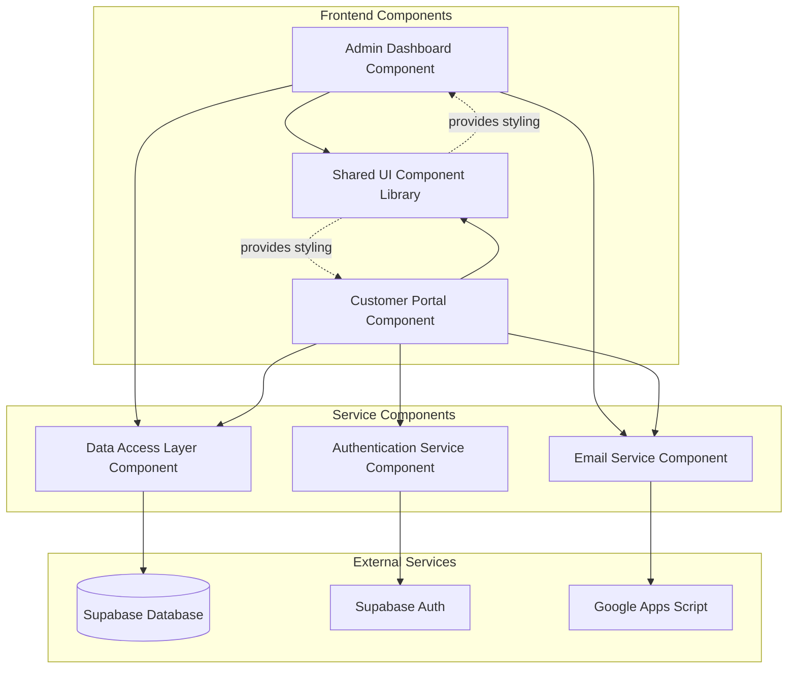

# Components

## Admin Dashboard Component

**Responsibility:** Maintains all existing admin functionality including PDF processing, order management, invoice generation, and business analytics, while adding customer management capabilities.

**Key Interfaces:**
- Order management interface (extended with customer portal orders)
- Customer management interface (new - view registered customers)
- PDF import and analysis interface (unchanged)
- Email queue management (extended for customer notifications)

**Dependencies:** Supabase database, Google Apps Script, PDF.js, Tesseract.js, shared UI components

**Technology Stack:** Vanilla JavaScript (script.js), existing HTML/CSS, FontAwesome icons, maintains current modular function organization

## Customer Portal Component

**Responsibility:** Provides customer-facing interface for registration, authentication, product browsing, order placement, and account management.

**Key Interfaces:**
- Customer registration and login forms
- Product catalog display with pricing
- Shopping cart and checkout interface
- Order history and tracking interface
- Profile management interface

**Dependencies:** Supabase Auth, shared UI components, existing pricing data, email service integration

**Technology Stack:** Separate JavaScript file (customer.js), dedicated HTML entry point (customer.html), shared CSS framework

## Authentication Service Component

**Responsibility:** Handles customer authentication, session management, and security for the portal while maintaining admin access patterns.

**Key Interfaces:**
- Customer registration API calls
- Login/logout functionality
- JWT token management
- Session validation and refresh

**Dependencies:** Supabase Auth service, localStorage for session persistence

**Technology Stack:** JavaScript authentication utilities, Supabase client library, JWT handling

## Data Access Layer Component

**Responsibility:** Abstracts database operations for both admin and customer functionality, providing consistent interface to Supabase operations.

**Key Interfaces:**
- Customer CRUD operations
- Extended order operations (with source tracking)
- Order item management
- Existing import and invoice operations (unchanged)

**Dependencies:** Supabase client, localStorage fallback, existing data persistence patterns

**Technology Stack:** JavaScript repository pattern functions, async/await operations, error handling wrappers

## Email Service Component

**Responsibility:** Manages email communications for both admin notifications and customer confirmations using existing Google Apps Script integration.

**Key Interfaces:**
- Customer order confirmation emails
- Admin notification emails (unchanged)
- Email queue management (extended)
- Template processing for different email types

**Dependencies:** Google Apps Script HTTP service, existing email templates

**Technology Stack:** JavaScript HTTP calls, existing email queue patterns, template string processing

## Shared UI Component Library

**Responsibility:** Provides reusable UI components, styling, and utilities shared between admin dashboard and customer portal.

**Key Interfaces:**
- Common form components and validation
- Card layouts and navigation patterns
- Loading states and error handling
- Modal dialogs and notifications

**Dependencies:** FontAwesome icons, CSS Grid/Flexbox framework

**Technology Stack:** Shared CSS classes, JavaScript utility functions, responsive design patterns

## Component Diagrams

