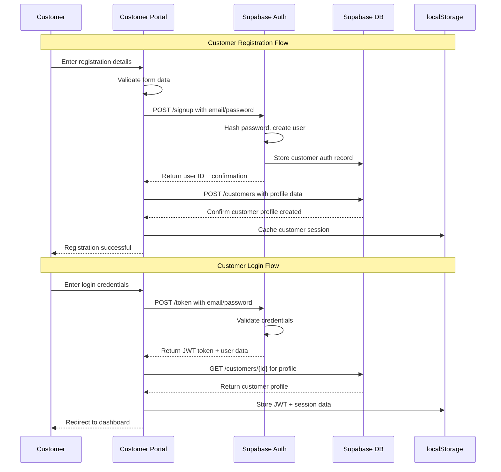
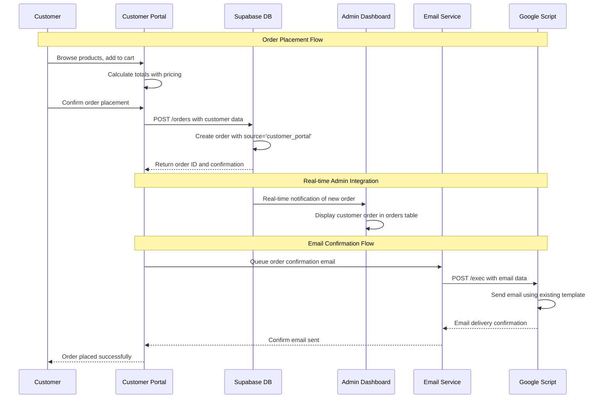
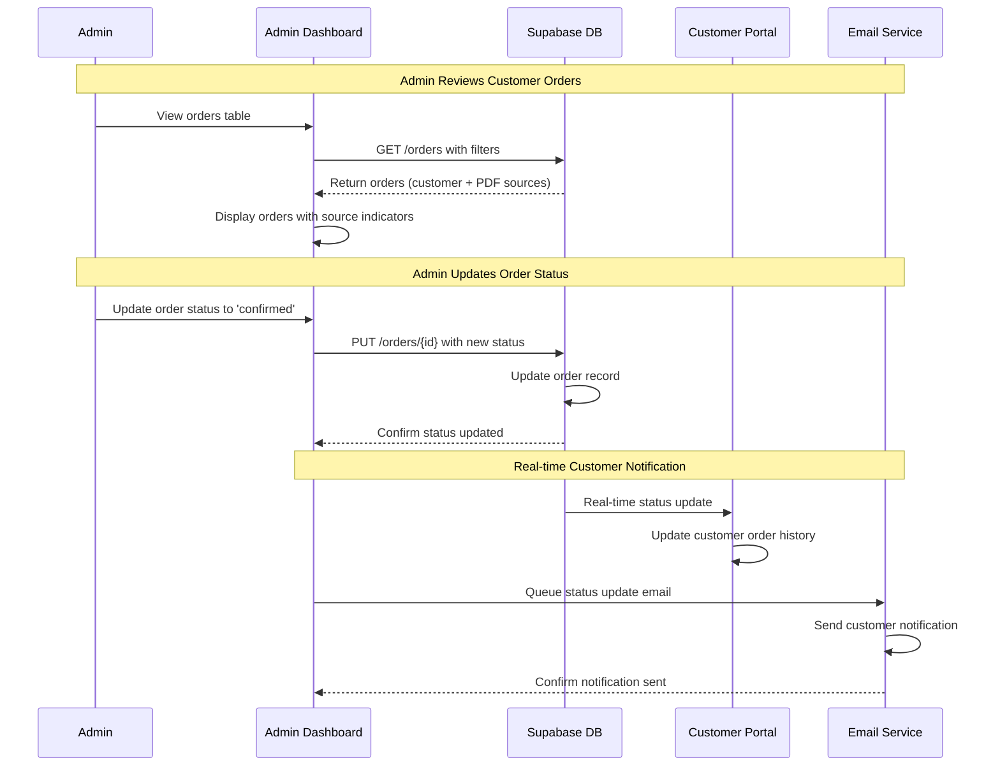
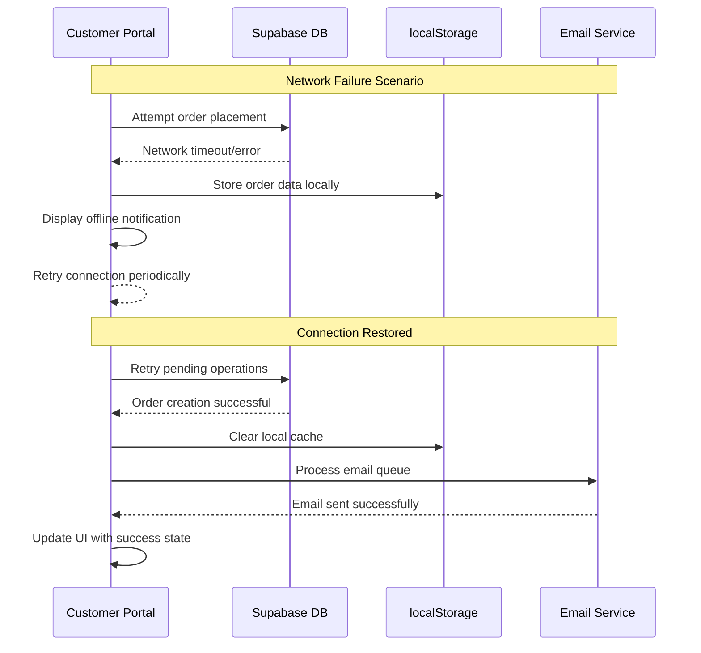

# Core Workflows

## Customer Registration and Login Workflow

## Customer Order Placement Workflow

## Admin Order Processing Workflow (Extended)

## Error Handling and Offline Capability Workflow

