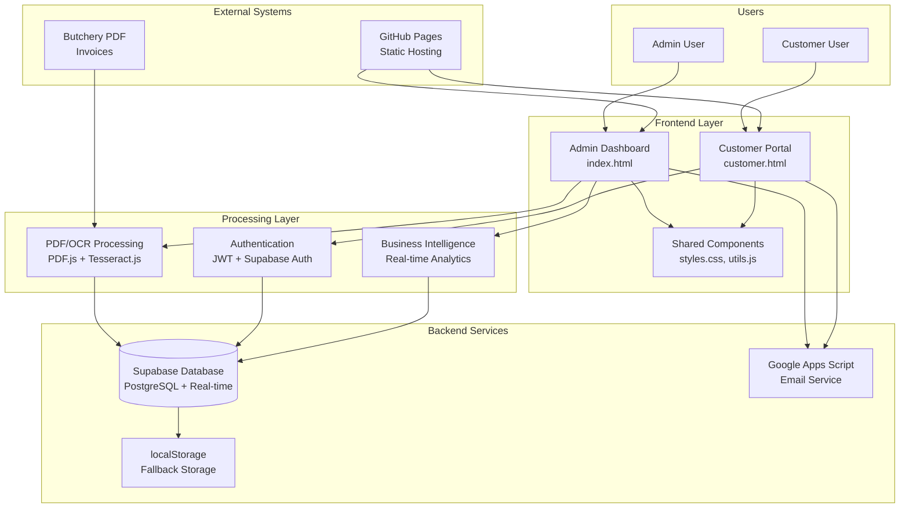

# High Level Architecture

## Technical Summary

The Plaas Hoenders system employs a **hybrid client-server architecture** with static frontend hosting and cloud-managed backend services. The architecture extends the existing admin dashboard with a customer portal that shares core infrastructure while maintaining clear separation of concerns. Key components include dual-layer data persistence (Supabase primary, localStorage fallback), sophisticated PDF processing with AI/OCR, and Google Apps Script for email automation. The system follows a **modular monolithic pattern** with clear component boundaries, enabling the customer portal to integrate seamlessly without disrupting existing butchery workflow operations. This architecture directly supports the PRD goals of customer self-service while preserving the proven admin dashboard functionality.

## High Level Overview

**Architectural Style**: **Modular Monolithic** with service-oriented components
- Single codebase with clear module boundaries
- Shared infrastructure between admin and customer interfaces
- Component-based organization enabling independent development

**Repository Structure**: **Monorepo approach**
- Single repository housing both admin dashboard and customer portal
- Shared utilities and styling components
- Unified deployment pipeline via GitHub Pages

**Service Architecture**: **Static Frontend + Managed Backend Services**
- Frontend: Static HTML/CSS/JavaScript served from GitHub Pages
- Database: Supabase (managed PostgreSQL) with real-time capabilities  
- Email: Google Apps Script HTTP service
- Authentication: Client-side JWT with Supabase Auth integration

**Primary Data Flow**:
1. **Admin Flow**: PDF Upload → OCR Processing → Order Import → Invoice Generation → Email Queue
2. **Customer Flow**: Authentication → Product Browse → Order Placement → Admin Integration → Email Confirmation
3. **Unified Backend**: Both flows converge in Supabase database with shared pricing and email systems

**Key Architectural Decisions**:
- **Shared Infrastructure**: Customer portal leverages existing Supabase and email systems (reduces complexity, ensures consistency)
- **Separate Entry Points**: customer.html and index.html provide distinct interfaces while sharing core components
- **Component Isolation**: Customer functionality isolated in separate JavaScript files to prevent admin impact

## High Level Project Diagram

## Architectural and Design Patterns

**- Modular Monolith Pattern:** Single codebase with clear module boundaries between admin and customer functionality - *Rationale:* Enables shared infrastructure while maintaining development independence and simplified deployment

**- Repository Pattern:** Abstract data access through consistent interfaces for Supabase operations - *Rationale:* Provides testability, enables fallback to localStorage, and supports future database migrations if needed

**- Dual-Layer Persistence:** Supabase primary storage with localStorage backup/cache - *Rationale:* Ensures system availability during network issues while providing real-time sync capabilities

**- Component-Based UI:** Reusable UI components shared between admin and customer interfaces - *Rationale:* Maintains visual consistency, reduces code duplication, and accelerates customer portal development

**- Event-Driven Email Queue:** Asynchronous email processing through queue mechanism - *Rationale:* Prevents blocking operations, enables batch processing, and provides retry capabilities for failed deliveries

**- Stateless Authentication:** JWT tokens with client-side session management - *Rationale:* Aligns with static hosting model, reduces server complexity, and enables offline capability
